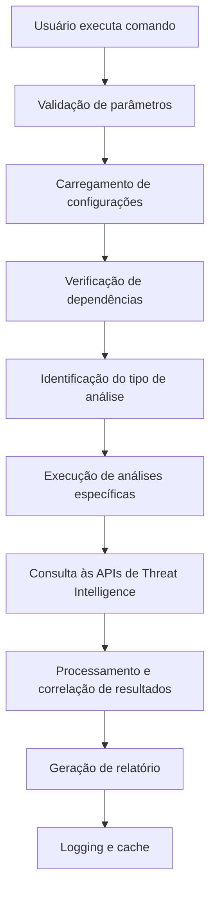

# 🔧 Detalhes Técnicos - Security Analyzer Tool

## Arquitetura da Aplicação

### Componentes Principais

```
Security Analyzer Tool
├── Core Engine (security_analyzer.sh)
├── Threat Intelligence Module (threat_intel_apis.sh)
├── Email Analysis Module (email_analyzer.sh)
├── Configuration Manager (config.sh)
└── Dependency Installer (install_dependencies.sh)
```

### Fluxo de Execução


```mermaid
graph TD
    A[Usuário executa comando] --> B[Validação de parâmetros]
    B --> C[Carregamento de configurações]
    C --> D[Verificação de dependências]
    D --> E[Identificação do tipo de análise]
    E --> F[Execução de análises específicas]
    F --> G[Consulta às APIs de Threat Intelligence]
    G --> H[Processamento e correlação de resultados]
    H --> I[Geração de relatório]
    I --> J[Logging e cache]
```

## APIs e Integrações

### VirusTotal API v3

**Endpoint**: `https://www.virustotal.com/api/v3/`

**Funcionalidades**:
- Análise de arquivos por hash
- Análise de URLs
- Consulta de domínios
- Verificação de IPs

**Implementação**:
```bash
analyze_hash_virustotal() {
    local hash="$1"
    local response
    response=$(curl -s -H "x-apikey: $VIRUSTOTAL_API_KEY" \
        "https://www.virustotal.com/api/v3/files/$hash")
    
    # Processamento da resposta JSON
    local malicious suspicious
    malicious=$(echo "$response" | jq -r '.data.attributes.last_analysis_stats.malicious // 0')
    suspicious=$(echo "$response" | jq -r '.data.attributes.last_analysis_stats.suspicious // 0')
}
```

### URLScan.io API

**Endpoint**: `https://urlscan.io/api/v1/`

**Processo**:
1. Submissão da URL para análise
2. Aguardo do processamento (10-15 segundos)
3. Recuperação dos resultados
4. Análise de verdicts e screenshots

### Shodan API

**Endpoint**: `https://api.shodan.io/`

**Consultas**:
- Informações de hosts por IP
- Busca por hostname
- Dados de serviços e portas
- Geolocalização

### ThreatFox (Abuse.ch)

**Endpoint**: `https://threatfox-api.abuse.ch/api/v1/`

**Método**: POST com JSON payload
```json
{
    "query": "search_ioc",
    "search_term": "hash_or_ioc"
}
```

## Estrutura de Dados

### Configuração de APIs

```bash
# ~/.security_analyzer/api_keys.conf
VIRUSTOTAL_API_KEY="chave_virustotal"
SHODAN_API_KEY="chave_shodan"
URLSCAN_API_KEY="chave_urlscan"
HYBRID_ANALYSIS_API_KEY="chave_hybrid"
```

### Formato de Log

```
[TIMESTAMP] TIPO_ANALISE: ALVO (RESULTADO)
[2025-07-18 16:00:00] Arquivo analisado: malware.exe (MD5: abc123, SHA256: def456)
[2025-07-18 16:01:00] URL analisada: https://malicious.com
[2025-07-18 16:02:00] Domínio analisado: suspicious.org
```

### Estrutura de Relatório JSON

```json
{
    "target": "alvo_da_analise",
    "type": "file|url|domain|hash|email",
    "timestamp": "2025-07-18T16:00:00Z",
    "metadata": {
        "file_size": "1024000",
        "file_type": "PE32 executable",
        "md5": "abc123...",
        "sha256": "def456..."
    },
    "results": [
        {
            "source": "VirusTotal",
            "result": "malicious|suspicious|clean",
            "status": "detalhes_especificos",
            "confidence": 95,
            "details": {
                "detections": 45,
                "total_engines": 70
            }
        }
    ],
    "summary": {
        "threat_level": "high|medium|low",
        "recommendation": "texto_recomendacao"
    }
}
```

## Algoritmos de Análise

### Detecção de Hash

```bash
detect_hash_type() {
    local hash="$1"
    case ${#hash} in
        32) echo "MD5" ;;
        40) echo "SHA1" ;;
        64) echo "SHA256" ;;
        128) echo "SHA512" ;;
        *) echo "Unknown" ;;
    esac
}
```

### Extração de IPs de Cabeçalhos

```bash
extract_ips() {
    grep -oE '\b([0-9]{1,3}\.){3}[0-9]{1,3}\b' "$1" | \
    grep -v -E '^(10\.|172\.(1[6-9]|2[0-9]|3[01])\.|192\.168\.|127\.)' | \
    sort -u
}
```

### Verificação de Blacklists

```bash
check_rbl() {
    local ip="$1"
    local rbl="$2"
    local reversed_ip=$(echo "$ip" | awk -F. '{print $4"."$3"."$2"."$1}')
    
    if dig +short "$reversed_ip.$rbl" | grep -q "127.0.0"; then
        return 0  # Listado
    else
        return 1  # Limpo
    fi
}
```

## Sistema de Cache

### Estrutura do Cache

```
~/.security_analyzer/cache/
├── virustotal/
│   ├── hash_abc123.json
│   └── url_def456.json
├── shodan/
│   └── ip_1.2.3.4.json
└── urlscan/
    └── scan_uuid123.json
```

### Implementação do Cache

```bash
get_cache() {
    local cache_type="$1"
    local cache_key="$2"
    local cache_file="$CACHE_DIR/$cache_type/$cache_key.json"
    
    if [[ -f "$cache_file" ]]; then
        # Verificar se cache não expirou (24 horas)
        if [[ $(find "$cache_file" -mtime -1) ]]; then
            cat "$cache_file"
            return 0
        fi
    fi
    return 1
}

set_cache() {
    local cache_type="$1"
    local cache_key="$2"
    local data="$3"
    local cache_dir="$CACHE_DIR/$cache_type"
    
    mkdir -p "$cache_dir"
    echo "$data" > "$cache_dir/$cache_key.json"
}
```

## Rate Limiting

### Implementação

```bash
API_RATE_LIMIT_DELAY=1  # segundos entre chamadas

rate_limit() {
    local last_call_file="$CACHE_DIR/.last_api_call"
    
    if [[ -f "$last_call_file" ]]; then
        local last_call=$(cat "$last_call_file")
        local current_time=$(date +%s)
        local time_diff=$((current_time - last_call))
        
        if [[ $time_diff -lt $API_RATE_LIMIT_DELAY ]]; then
            sleep $((API_RATE_LIMIT_DELAY - time_diff))
        fi
    fi
    
    date +%s > "$last_call_file"
}
```

## Tratamento de Erros

### Códigos de Retorno

- `0`: Sucesso
- `1`: Erro geral
- `2`: Arquivo não encontrado
- `3`: Dependência faltando
- `4`: Erro de API
- `5`: Erro de configuração

### Tratamento de Exceções

```bash
handle_api_error() {
    local api_name="$1"
    local http_code="$2"
    local response="$3"
    
    case "$http_code" in
        200) return 0 ;;
        401) echo "Erro de autenticação em $api_name" ;;
        403) echo "Acesso negado em $api_name" ;;
        429) echo "Rate limit excedido em $api_name" ;;
        500) echo "Erro interno do servidor $api_name" ;;
        *) echo "Erro desconhecido ($http_code) em $api_name" ;;
    esac
    
    log_message "Erro API $api_name: $http_code - $response"
    return 1
}
```

## Segurança

### Proteção de Chaves de API

```bash
# Permissões restritivas
chmod 600 ~/.security_analyzer/api_keys.conf

# Verificação de permissões
check_api_keys_security() {
    local perms=$(stat -c "%a" "$API_KEYS_FILE" 2>/dev/null)
    if [[ "$perms" != "600" ]]; then
        echo "Aviso: Permissões inseguras no arquivo de chaves"
        chmod 600 "$API_KEYS_FILE"
    fi
}
```

### Sanitização de Entrada

```bash
sanitize_input() {
    local input="$1"
    # Remove caracteres perigosos
    echo "$input" | sed 's/[;&|`$(){}[\]\\]//g'
}

validate_hash() {
    local hash="$1"
    if [[ ! "$hash" =~ ^[a-fA-F0-9]+$ ]]; then
        echo "Hash inválido: contém caracteres não hexadecimais"
        return 1
    fi
}
```

## Performance

### Otimizações Implementadas

1. **Cache Inteligente**: Evita consultas desnecessárias
2. **Consultas Paralelas**: Múltiplas APIs consultadas simultaneamente
3. **Rate Limiting**: Respeita limites das APIs
4. **Timeout Configurável**: Evita travamentos

### Métricas de Performance

```bash
# Tempo de execução
start_time=$(date +%s.%N)
# ... código ...
end_time=$(date +%s.%N)
execution_time=$(echo "$end_time - $start_time" | bc)
```

## Extensibilidade

### Adicionando Nova API

1. Criar função de consulta:
```bash
query_new_api() {
    local target="$1"
    echo "Consultando Nova API: $target"
    # Implementação da consulta
}
```

2. Integrar no módulo principal:
```bash
# Em threat_intel_apis.sh
export -f query_new_api
```

3. Chamar na análise:
```bash
# Em security_analyzer.sh
query_new_api "$target"
```

### Adicionando Novo Tipo de Análise

1. Criar função específica
2. Adicionar opção no parser de argumentos
3. Implementar lógica de análise
4. Atualizar documentação

## Debugging

### Modo Debug

```bash
# Ativar debug
export DEBUG=1
./security_analyzer.sh -d example.com

# Função de debug
debug_log() {
    if [[ "$DEBUG" == "1" ]]; then
        echo "[DEBUG] $1" >&2
    fi
}
```

### Logs Detalhados

```bash
# Habilitar logs verbosos
export VERBOSE=1

verbose_log() {
    if [[ "$VERBOSE" == "1" ]]; then
        echo "[VERBOSE] $1" | tee -a "$LOG_FILE"
    fi
}
```

## Testes

### Testes Automatizados

```bash
# examples/test_samples.sh
run_tests() {
    local tests_passed=0
    local tests_total=0
    
    # Teste 1: Hash conhecido
    ((tests_total++))
    if test_known_hash; then
        ((tests_passed++))
        echo "✓ Teste de hash: PASSOU"
    else
        echo "✗ Teste de hash: FALHOU"
    fi
    
    echo "Testes: $tests_passed/$tests_total passaram"
}
```

### Testes de Integração

```bash
test_api_connectivity() {
    local apis=("virustotal" "urlscan" "shodan")
    
    for api in "${apis[@]}"; do
        if test_api_connection "$api"; then
            echo "✓ $api: Conectado"
        else
            echo "✗ $api: Falha na conexão"
        fi
    done
}
```

## Monitoramento

### Métricas Coletadas

- Número de análises por tipo
- Tempo médio de execução
- Taxa de sucesso das APIs
- Uso de cache

### Relatório de Estatísticas

```bash
generate_stats() {
    echo "=== Estatísticas de Uso ==="
    echo "Total de análises: $(grep -c "analisado" "$LOG_FILE")"
    echo "Arquivos analisados: $(grep -c "Arquivo analisado" "$LOG_FILE")"
    echo "URLs analisadas: $(grep -c "URL analisada" "$LOG_FILE")"
    echo "Domínios analisados: $(grep -c "Domínio analisado" "$LOG_FILE")"
}
```

---

*Este documento técnico fornece uma visão detalhada da implementação interna da ferramenta Security Analyzer Tool.*
